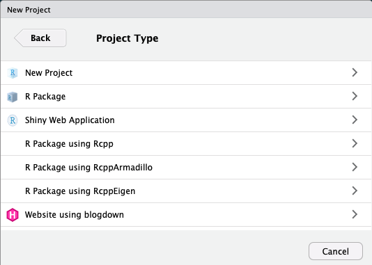
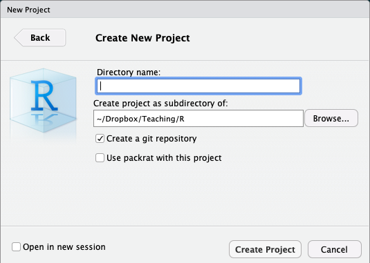
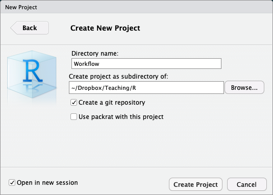
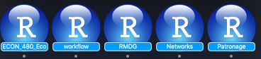
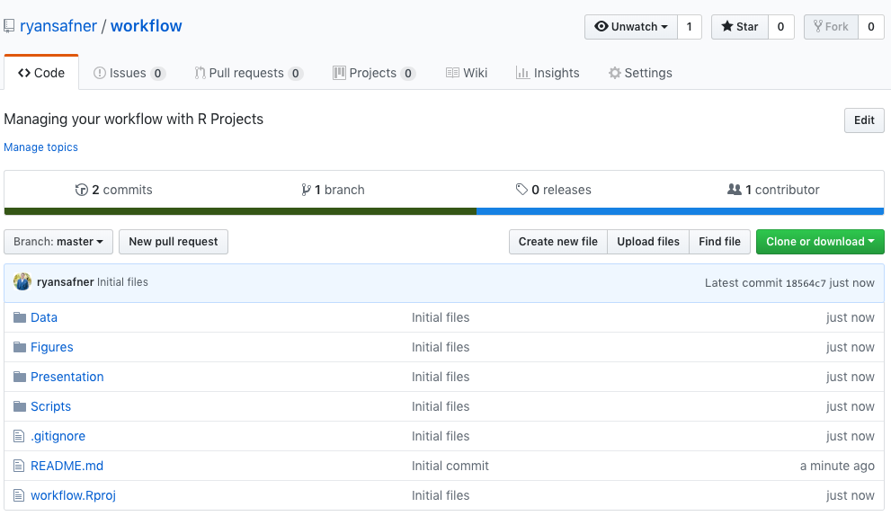
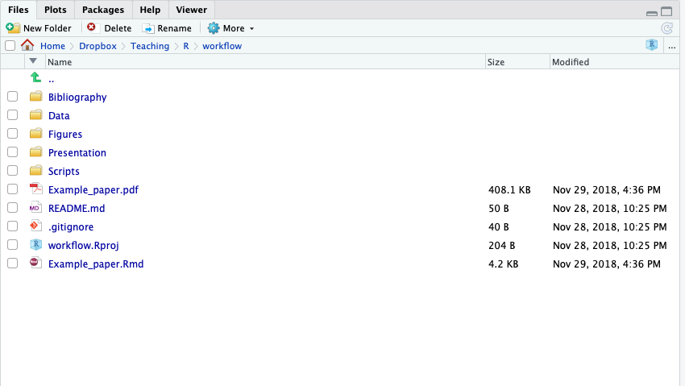
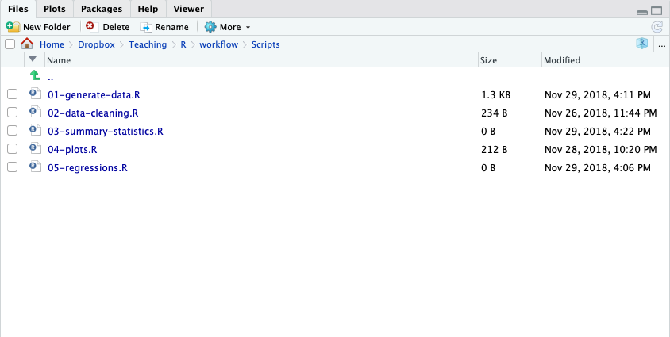
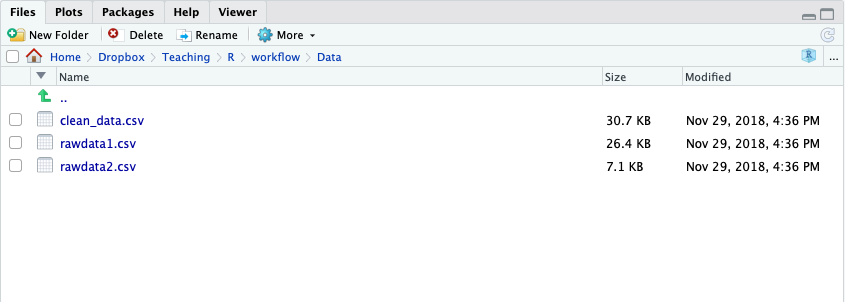

```{r setup, include=FALSE}
knitr::opts_chunk$set(echo = FALSE)
```

### Projects

- A **project** is a way of systematically organizing your `R` history, working directory, and related files in a single package
- Can easily be sent to others who can reproduce your work easily 
- Connects well with version control software like GitHub
- Can open multiple projects in multiple windows

### Projects: The Single Solution To Many Problems 

- Projects solve all of the following problems:
    1. Organizing your files (data, plots, text, citations, etc)
    2. Having an accessible working directory (for loading and saving data, plots, etc)
    3. Saving and reloading your commands history and preferences
    4. Sending files to collaborators, so they have the same working directory as you

### Creating a Project


### Creating a Project II



### Creating a Project: Types

- In almost all cases, you simply want a `New Project`
- For more advanced uses, your project can be an `R Package` or a `Shiny Web Application`
- If you have other packages that create templates installed (as I do, in the previous image), they will also show up as options

### Creating a Project III 



### Creating a Project III 

- Enter a name for the project in the top field 
    - Also creates a folder on your computer with the name you enter into the field
- Choose the location of the folder on your computer
- Depending on if you have other packages or utilities installed (such as `git`), there may be additional options, do not check them unless you know what you are doing
- Lastly, the bottom left checkbox allows you to open a new instance (window) of `R` just for this project (and keep existing windows open)

### Creating a Project IV 



### Switching Between Projects



### Loading Someone Else's Project



### The Structure of This Project




### The Structure of This Project



### The Structure of This Project



### The Structure of This Project

- Read the `README` of this repository on GitHub for instructions (automatically shows on the main page)
- Look at the `Example_paper.Rmd`
    - Uses data from **Data** folder
    - Uses `.R` scripts from **Scripts** folder
    - Uses figures from **Figures** folder 
    - Uses `bibexample.bib` from **Bibliography** folder
- This file is `workflow.presentation.Rmd` in **Presentation** folder

